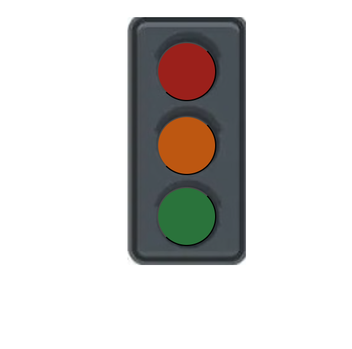
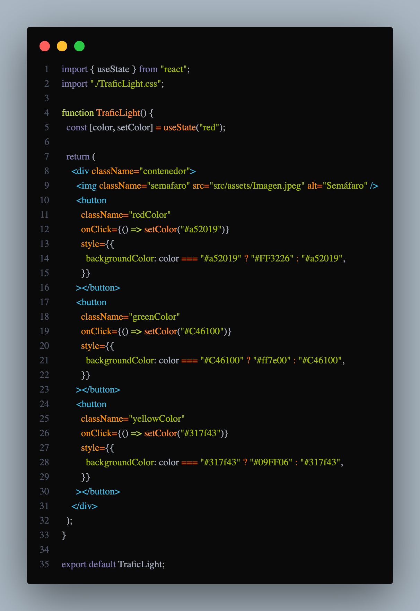

# 🚦 SEMÁFARO-REACT

Este es mi proyecto de semáfaro de react **super básico** espero que este bien

## 🌐 Tecnologías

- React
- javascript + swc

## Semáfaro-Result

## Código-Semáfaro

- [@vitejs/plugin-react-swc](https://github.com/vitejs/vite-plugin-react-swc) uses [SWC](https://swc.rs/) for Fast Refresh
